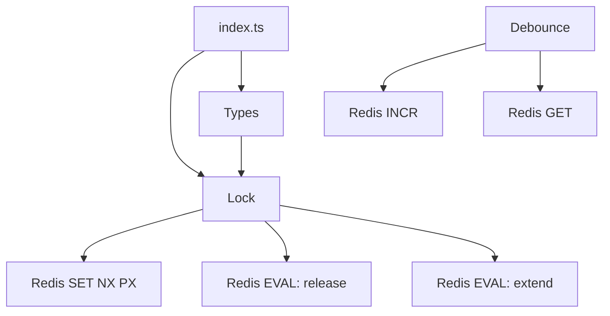

This library is intentionally small. The implementation lives in two core classes and a shared types module, with a single entry point that re-exports the public surface. The design prioritizes predictable Redis operations and minimal moving parts so the behavior is easy to reason about.

**Key Design Decisions**
- **Single-key lock per critical section.** In `src/lock.ts`, each lock instance operates on exactly one Redis key (`config.id`). This keeps state minimal and allows `SET NX PX` to be the authoritative acquisition check. The key name becomes the coordination point for all instances.
- **UUID ownership tracking.** The lock stores a UUID in Redis when acquired and keeps the same UUID in memory (`config.UUID`). `release()` and `extend()` use that UUID to guard against releasing or extending another instance’s lock. You can see this in the Lua scripts inside `src/lock.ts`.
- **Best-effort safety, not consensus.** The README explicitly discourages using this for correctness guarantees like leader election. The code mirrors that: no fencing tokens, no quorum, and no clock synchronization. This is a pragmatic trade-off for simplicity and serverless suitability.
- **Lua for atomic operations.** Redis does not provide a built-in “compare-and-delete” or “compare-and-extend” command. The library uses `eval` scripts to ensure those operations are atomic (`release()` and `extend()` in `src/lock.ts`).
- **Distributed debounce via a counter.** `src/debounce.ts` uses `INCR` and `GET` with a wait delay to determine the “last” invocation in a window. It is intentionally simple and does not track per-caller state.

**How the Pieces Fit Together**
The public entry point is `src/index.ts`, which re-exports the `Lock` class and all exported types from `src/types.ts`. The `Lock` class is the primary API. `Debounce` is defined in `src/debounce.ts` and uses the same Redis client type, but it is not re-exported from `src/index.ts` in this repository.

**Lock lifecycle data flow**
1. The caller constructs a `Lock` with a Redis client and key name. The constructor normalizes defaults (`lease`, `retry.attempts`, `retry.delay`) in `src/lock.ts`.
2. `acquire()` attempts a Redis `SET` with `NX` (only set if the key does not exist) and `PX` (set TTL in milliseconds). If it returns `OK`, the lock is acquired and the UUID is stored in memory.
3. If acquisition fails, the method waits `retry.delay` milliseconds and tries again up to `retry.attempts` times.
4. `release()` executes a Lua script that deletes the key only if the stored UUID matches the instance UUID, preventing accidental release by a different instance.
5. `extend()` executes a Lua script that reads the current TTL and extends it by a requested amount only if ownership still matches.

**Debounce data flow**
1. Each call to `Debounce.call()` increments a counter at the debounce key using `INCR`.
2. The method sleeps for the configured `wait` duration.
3. It reads the current value from Redis and compares it to the value returned by `INCR` earlier. If the value changed, another call happened, so the callback is skipped. If it is unchanged, the callback runs.

**Why this architecture works for serverless**
- No in-memory coordination; all coordination happens in Redis and survives cold starts.
- One key per lock/debounce, so the Redis footprint is predictable.
- A single `Redis` client instance (from `@upstash/redis`) is sufficient across all operations.

If you want to see how these primitives map to user workflows, the next pages cover the lock lifecycle and debounce mechanics in detail.

<Cards>
  <Card title="Lock Lifecycle" href="/docs/lock-lifecycle">How acquisition, release, and status checking work internally.</Card>
  <Card title="Lease and Retry" href="/docs/lease-and-retry">Configuration trade-offs that impact reliability.</Card>
  <Card title="Distributed Debounce" href="/docs/distributed-debounce">How the debounce counter algorithm works.</Card>
</Cards>
