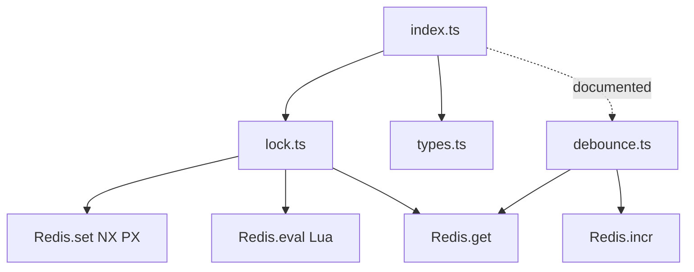

This library is intentionally small: it exposes a single entry point, builds two primitives (`Lock` and `Debounce`), and relies on Upstash Redis for distributed coordination. The internal layout mirrors that simplicity.

**Key Design Decisions**
- **Single, explicit entry point.** The build is configured to bundle only `src/index.ts`, which exports `Lock` and the type definitions. This keeps the public surface area tight and predictable.
- **Redis-backed atomicity.** Acquisition uses `SET` with `NX` and `PX`, so only one client can create the key and the lease is enforced by Redis. Release and extension are handled by Lua scripts to check UUID ownership and update TTL atomically.
- **Best-effort guarantees.** The README explicitly documents that this is not a correctness primitive for leader election. The code reflects this: it doesn't attempt quorum or multi-key consensus, just a single Redis key per lock.
- **UUID-based ownership.** Each acquisition uses a UUID to mark ownership. This UUID is validated on release/extend, protecting against accidental release of someone else's lock when a lease expires and is re-acquired.
- **Lightweight debounce.** The debounce implementation is intentionally minimal: a Redis counter is incremented on each call, and the callback only fires if that counter hasn't changed after the wait period. This is simple, cross-instance, and aligns with a "best-effort" model.

**How the Pieces Fit Together**
- `index.ts` re-exports `Lock` and `types`, forming the API boundary consumed by applications. This is the entry used by the build pipeline.
- `lock.ts` contains all locking logic. It owns the default configuration values and runtime state (`UUID` and `lease`).
- `types.ts` centralizes all shared configuration and result types so the class API and its users agree on shapes and defaults.
- `debounce.ts` is the debounce primitive, used in tests and README examples. It is separate from locking, but uses the same Redis client and best-effort semantics.

The result is a small library that is easy to embed in serverless or multi-instance backends. The key infrastructure dependency is Upstash Redis, provided via `@upstash/redis`, and the only runtime assumption is the availability of `crypto.randomUUID()` (or a supplied UUID).

<Callout type="warn">The lock is intentionally not a strong correctness primitive. Use it to reduce duplicate work, not for leader election or exactly-once guarantees.</Callout>
