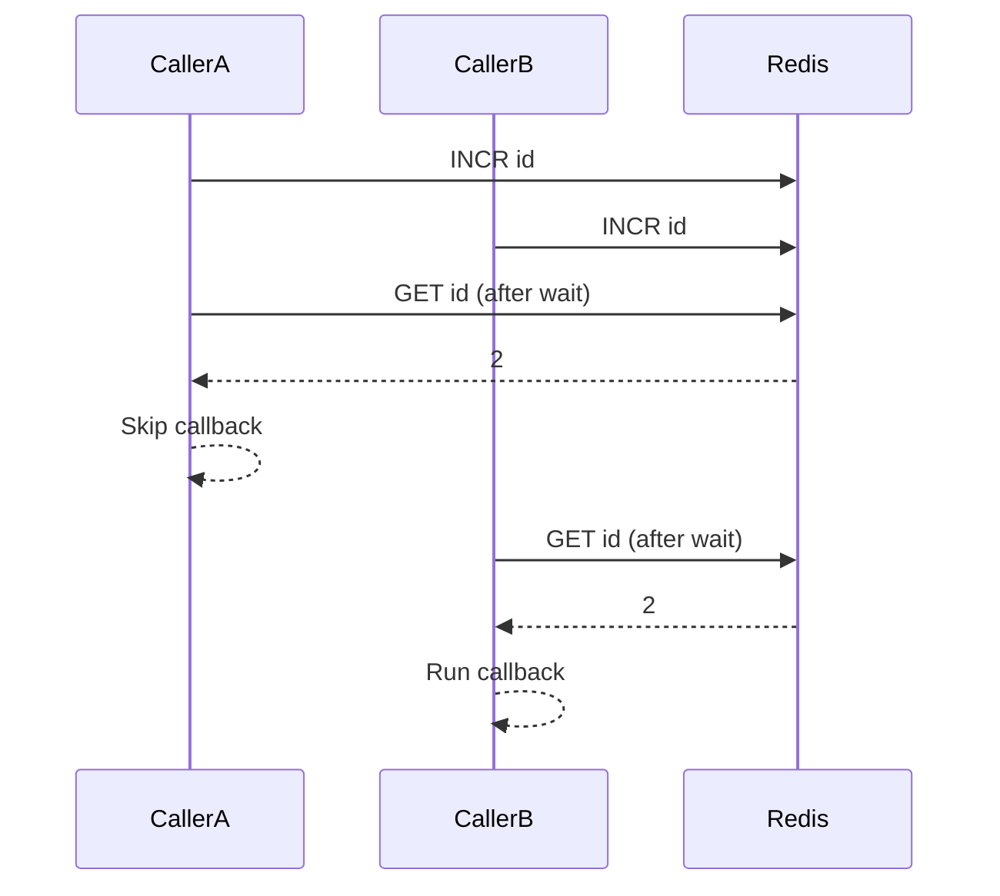

The Debounce class provides a cross-instance debounce mechanism. Each call increments a Redis counter for a shared `id`. After a wait period, only the most recent caller (the one that sees an unchanged counter) runs the callback. This is useful for coalescing bursts of requests into a single execution.

<Callout type="info">`Debounce` is implemented in `src/debounce.ts` and used in tests and README examples. The package entry point currently exports `Lock` and the shared types from `src/index.ts`.</Callout>



**What it is**
A distributed debounce uses Redis to coordinate across processes, ensuring a callback fires at most once per wait period for a given `id`.

**Why it exists**
In serverless or multi-instance systems, you can't debounce in memory. This primitive provides best-effort coalescing across all instances that share the same Redis key.

**How it relates to other concepts**
- Debounce uses the same Redis client as Lock, but it is counter-based rather than UUID-based.
- It shares the same best-effort guarantee as the lock. See [Lock Lifecycle](./lock-lifecycle).

**Example: One callback per wait period**

```typescript src/debounce.test.ts
let count = 0;

const uniqueId = getUniqueFunctionId();
const debouncedFunction = new Debounce({
  id: uniqueId,
  redis: Redis.fromEnv(),

  // Wait time of 1 second
  // The debounced function will only be called once per second
  wait: 1000,

  // Callback function to be debounced
  callback: () => {
    // Increment the counter
    count++;
  },
});

for (let i = 0; i < 10; i++) {
  debouncedFunction.call();
}
```

**Example: Debounce with arguments**

```typescript src/debounce.test.ts
let coolWord = "";

const uniqueId = getUniqueFunctionId();
const debouncedFunction = new Debounce({
  id: uniqueId,
  redis: Redis.fromEnv(),
  wait: 1000,
  callback: (word: string) => {
    coolWord = word;
  },
});

const words = ["Upstash", "Is", "A", "Serverless", "Database", "Provider"];

for (const word of words) {
  debouncedFunction.call(word);
}
```

<Callout type="warn">This debounce is best-effort. A process crash or a Redis outage can prevent the callback from running or allow multiple callbacks within the same window.</Callout>

<Accordions>
  <Accordion title="Trade-offs and alternatives">
  This design is lightweight and cross-instance, but it doesn't guarantee execution. If you need guaranteed scheduling or durable execution, consider a queue or workflow engine that persists work and retries explicitly.
  </Accordion>
</Accordions>
