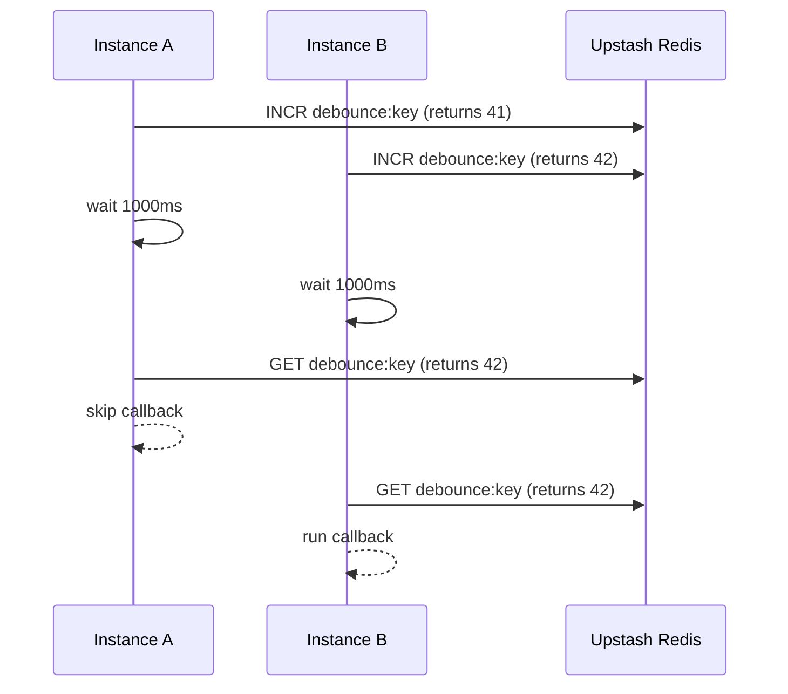

A distributed debounce ensures that a callback runs only once after a burst of calls, even when those calls happen on different machines or serverless invocations. The implementation in `src/debounce.ts` uses a single Redis counter key to decide which call gets to run the callback.



**What the concept is**
A distributed debounce is a time-windowed gating mechanism. It does not enforce mutual exclusion; instead, it ensures only the last call in a window executes a callback. This is useful for collapsing bursts of events like webhooks, user typing, or repetitive cron triggers.

**Why it exists**
In serverless and multi-instance environments, local debounce utilities do not coordinate across instances. This implementation uses Redis as a shared counter so that all callers can observe the same “latest” invocation.

**How it works internally**
- `call()` increments a counter with `INCR` and stores the returned integer in a local variable (`thisTaskIncr`).
- It sleeps for the configured `wait` duration using `setTimeout`.
- After the wait, it reads the current counter with `GET`.
- If the counter value is still equal to `thisTaskIncr`, this call was the most recent, and it executes the callback. If the counter changed, a newer call happened and this call exits without running the callback.
- The code is intentionally minimal and relies on Redis atomicity for `INCR` and consistent `GET` reads.

**How it relates to other concepts**
- The **Lock Lifecycle** concept guarantees mutual exclusion per key. Debounce does not and does not track ownership.
- The **Lease and Retry** concept is about acquiring a lock under contention. Debounce is about deferring execution until a quiet period.

**Basic usage**
```typescript filename="debounce-basic.ts"
import { Debounce } from "@upstash/lock";
import { Redis } from "@upstash/redis";

const redis = Redis.fromEnv();

const debounced = new Debounce({
  id: "events:search",
  redis,
  wait: 1000,
  callback: (query: string) => {
    console.log("search", query);
  },
});

await debounced.call("upstash");
```

**Advanced usage: async callback and multiple arguments**
```typescript filename="debounce-advanced.ts"
import { Debounce } from "@upstash/lock";
import { Redis } from "@upstash/redis";

const redis = Redis.fromEnv();

const debounced = new Debounce({
  id: "events:ingest",
  redis,
  wait: 1500,
  callback: async (payload: { id: string }, source: string) => {
    await writeToWarehouse(payload, source);
  },
});

await debounced.call({ id: "evt_123" }, "webhook");
await debounced.call({ id: "evt_456" }, "webhook");
```

<Callout type="warn">
In this repository, `Debounce` is defined in `src/debounce.ts` but not re-exported from `src/index.ts`. If your published package does not expose `Debounce`, you will need to import it from the build output or upgrade to a version that re-exports it. Verify your version’s exports before relying on this API.
</Callout>

<Callout type="warn">
The callback always runs after a full `wait` delay, even for the last call. If you need immediate execution followed by suppression, this is not the right algorithm.
</Callout>

<Accordions>
<Accordion title="Counter-based debounce vs timestamp-based debounce">
A counter-based debounce is very cheap: one `INCR` and one `GET` per call. It does not require clock synchronization or server time, which makes it a good fit for serverless runtimes. The trade-off is that it cannot tell you how much time has passed since the last call, only whether a newer call happened in the window. A timestamp-based approach can provide richer metrics but is more complex and needs additional logic to handle clock skew.
</Accordion>
<Accordion title="One shared key vs per-tenant keys">
Using one shared key for all debounced actions is simple but will merge unrelated events into a single debounce window. For real applications, you should use a key that includes the logical scope, such as a user ID, job type, or tenant. This increases Redis key count but avoids accidental suppression across unrelated work. Keep keys short and predictable to make monitoring easier.
</Accordion>
</Accordions>
