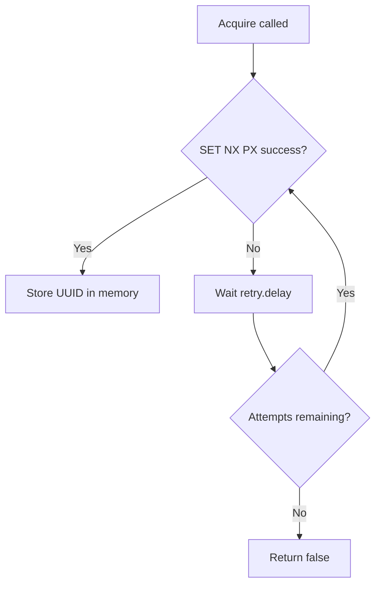

The lock’s behavior is controlled primarily by two knobs: **lease duration** and **retry policy**. These affect how long a lock is held, how quickly others can recover from a crash, and how much load you place on Redis when contending for the same key.



**What the concept is**
A **lease** is the TTL applied to the lock key when it is acquired. A **retry policy** is the number of attempts and delay between attempts when acquisition fails. These values are configured in the `Lock` constructor and can be overridden for a specific `acquire()` call. Both are defined in `src/types.ts` and applied in `src/lock.ts`.

**Why it exists**
Distributed locks need a safety valve: if the owner crashes, the lock should eventually become free. That is the role of a lease. Retries provide a controlled way to contend for the lock without hammering Redis or introducing tight loops.

**How it works internally**
- The constructor sets default values for `lease`, `retry.attempts`, and `retry.delay` (`DEFAULT_LEASE_MS = 10000`, `DEFAULT_RETRY_ATTEMPTS = 3`, `DEFAULT_RETRY_DELAY_MS = 100`) in `src/lock.ts`.
- `acquire()` reads optional overrides from `LockAcquireConfig`, then mutates the instance configuration to reflect the final lease.
- Each failed attempt uses `setTimeout` to sleep for the configured delay. This is a simple backoff mechanism; it is not exponential and does not jitter.
- The lease only affects Redis. The local instance does not track remaining TTL except when `extend()` is called.

**How it relates to other concepts**
- The **Lock Lifecycle** concept shows where lease and retry are applied in the overall flow.
- The **Distributed Debounce** concept also relies on a wait period, but it is tied to debounce windows rather than ownership leases.

**Basic usage: use defaults**
```typescript filename="defaults.ts"
import { Lock } from "@upstash/lock";
import { Redis } from "@upstash/redis";

const lock = new Lock({ id: "batch:cleanup", redis: Redis.fromEnv() });
await lock.acquire();
```

**Advanced usage: per-call overrides**
```typescript filename="overrides.ts"
import { Lock } from "@upstash/lock";
import { Redis } from "@upstash/redis";

const redis = Redis.fromEnv();
const lock = new Lock({
  id: "batch:cleanup",
  redis,
  lease: 5_000,
  retry: { attempts: 2, delay: 250 },
});

// Temporarily use a longer lease and more retries for a burst period
const acquired = await lock.acquire({
  lease: 20_000,
  retry: { attempts: 8, delay: 200 },
});
```

<Callout type="warn">
Very short leases can cause your lock to expire mid-task. If another instance acquires the lock after expiry, both may run concurrently. Choose a lease that safely exceeds your typical task duration or call `extend()` periodically.
</Callout>

<Callout type="warn">
Retrying with very small delays can spike Redis traffic under contention. This library does not implement exponential backoff or jitter; if you need that, add it in your caller and keep `retry.attempts` low.
</Callout>

<Accordions>
<Accordion title="Short lease vs long lease">
A short lease improves recovery when a worker crashes because the lock becomes available quickly. The downside is an increased chance of accidental overlap if your task runs longer than expected. A long lease reduces overlap but increases the window where a crashed worker blocks others. If you cannot confidently estimate task duration, consider a medium lease with a periodic `extend()` call to refresh ownership while the task is healthy.
</Accordion>
<Accordion title="Retry count vs fairness">
More retries increase the chance you will eventually acquire the lock, but they also reduce fairness for other contenders and can cause bursts of contention. Fewer retries reduce contention but may cause callers to give up too quickly and skip work. Because the retry delay is constant, synchronized callers may retry together and create waves; staggering retries in your calling code can improve fairness. For busy keys, treat the lock as a hint and accept that you might not acquire it every time.
</Accordion>
</Accordions>
