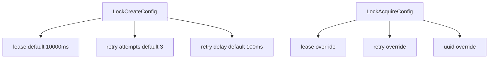

The lock lifecycle is controlled by two configuration surfaces: **lease** (how long the lock lives in Redis) and **retry** (how many times to attempt acquisition and how long to wait between attempts). These options are designed to give you predictable behavior without writing your own retry loops.



**What it is**
- **Lease** is the TTL attached to the lock key. When the lease expires, Redis automatically releases the lock.
- **Retry** defines how many times `acquire()` will attempt to set the lock and how long it will wait between attempts.

**Why it exists**
A lock that never expires is unsafe when processes crash. A lock that expires too quickly can be stolen before work completes. The lease and retry configuration allow you to balance availability and exclusivity for your workload.

**How it relates to other concepts**
- Lease and retry are used by `Lock#acquire`, which establishes the lock lifecycle. See [Lock Lifecycle](./lock-lifecycle).
- UUIDs are the ownership token used in release and extend, and can be overridden during acquisition. See [Lock Ownership](./lock-ownership).

**Example: Custom lease and retry values**

```typescript src/lock.test.ts
const uniqueId = getUniqueLockId();
const lock = new Lock({
  id: uniqueId,
  redis: Redis.fromEnv(),
  lease: 5000,
  retry: {
    attempts: 1,
    delay: 100,
  },
});
```

**Example: Acquire overrides in the implementation**

```typescript src/lock.ts
const lease = acquireConfig?.lease ?? this.config.lease;
this.config.lease = lease;
const retryAttempts = acquireConfig?.retry?.attempts ?? this.config.retry?.attempts;
const retryDelay = acquireConfig?.retry?.delay ?? this.config.retry?.delay;
```

<Callout type="warn">If your work can take longer than the lease, you must call `extend()` or choose a longer lease to avoid another client acquiring the lock while work is still running.</Callout>

<Accordions>
  <Accordion title="Trade-offs and alternatives">
  Short leases improve availability after crashes but increase the risk of overlapping work if processing runs long. Longer leases reduce overlap risk but delay recovery. If you need guarantees around completion, consider external job queues or consensus-based coordination.
  </Accordion>
</Accordions>
