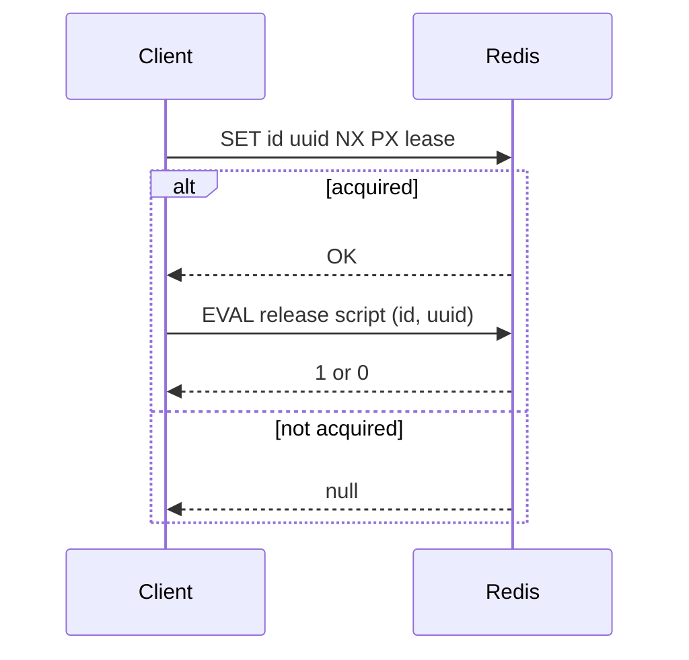

A lock in this library is a single Redis key guarded by a UUID. Acquiring a lock creates the key only if it does not already exist, the lease defines its lifetime, and releasing or extending the lock validates that the UUID still matches. This lifecycle is central to safe use of the library.



**What it is**
A lock is a Redis key (`id`) that stores a UUID. `Lock#acquire` sets the key only if it does not already exist (`NX`), and attaches a TTL (`PX`) so the lock automatically expires if it isn't released.

**Why it exists**
In serverless or multi-instance environments, you need a coordination point that all workers can see. Redis gives you atomic operations across instances, making it a good fit for best-effort mutual exclusion.

**How it relates to other concepts**
- The **UUID** is the ownership token that makes release and extension safe. See [Lock Ownership](./lock-ownership).
- **Lease and retry** control how long the lock lives and how hard a client will try before giving up.
- The **Debounce** utility uses Redis too, but it's counter-based rather than UUID-based. See [Debounce](./debounce).

**Example: Full lifecycle from tests**

```typescript src/lock.test.ts
const uniqueId = getUniqueLockId();
const lock = new Lock({
  id: uniqueId,
  redis: Redis.fromEnv(),
});

expect(lock.id).toBe(uniqueId);
expect(await lock.getStatus()).toBe("FREE");
const acquired = await lock.acquire();
expect(acquired).toBe(true);
const extended = await lock.extend(10000);
expect(extended).toBe(true);
const released = await lock.release();
expect(released).toBe(true);
expect(await lock.getStatus()).toBe("FREE");
```

**Example: Acquisition internals**

```typescript src/lock.ts
const upstashResult = await this.config.redis.set(this.config.id, UUID, {
  nx: true,
  px: lease,
});

if (upstashResult === "OK") {
  this.config.UUID = UUID;
  return true;
}
```

<Callout type="warn">Because Redis replication is asynchronous, a lock can be acquired by multiple clients during failures or partitions. Use this for efficiency, not correctness guarantees.</Callout>

<Accordions>
  <Accordion title="Trade-offs and alternatives">
  This lock is a single-key, best-effort primitive. It prioritizes simplicity and low latency over strict guarantees. If you need strong correctness (for example, leader election), you should evaluate multi-node consensus or specialized coordination services.
  </Accordion>
</Accordions>
