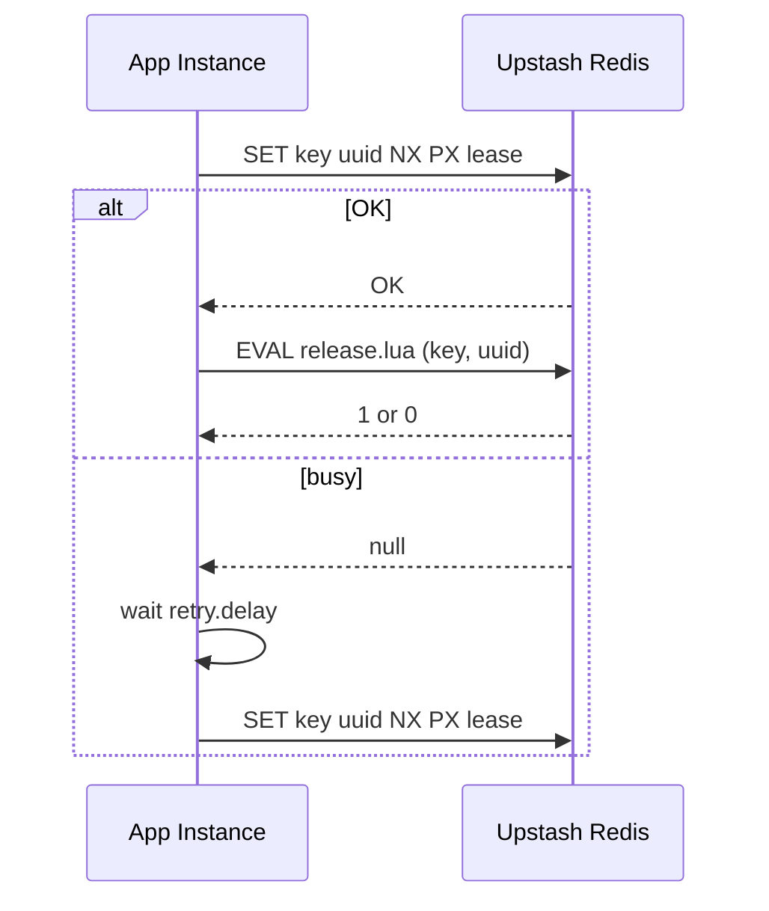

A lock in this library is a single Redis key whose value is a UUID owned by one instance. The lifecycle centers around acquiring that key with a lease, keeping the UUID in memory, and using Lua scripts to ensure safe release and extension.



**What the lock is**
A `Lock` is an object created with a unique `id` (the Redis key) and a `redis` client. Internally, the instance tracks the lease duration, retry behavior, and the UUID of the current ownership. This is defined in `src/lock.ts`, using types from `src/types.ts`.

**Why it exists**
Distributed systems often need a “best-effort” mutual exclusion mechanism to avoid double work. This library gives you that in a small, serverless-friendly package. It is not a consensus system; it is a coordination helper for tasks that can tolerate occasional overlap during failures.

**How it works internally**
- `acquire()` generates or accepts a UUID and tries `SET key uuid NX PX lease`. Only the first caller wins. If `SET` does not return `OK`, it waits and retries according to `retry.attempts` and `retry.delay`.
- On success, the UUID is stored on the instance (`config.UUID`). This value is the only proof of ownership the lock has.
- `release()` runs a Lua script that checks if the stored UUID matches the Redis value and deletes the key if it does. This prevents another instance from accidentally releasing your lock.
- `extend()` runs a Lua script that checks ownership, reads the current TTL, and extends it by the provided amount. The script uses `TTL` and `EXPIRE` to apply the new lease length.
- `getStatus()` compares the stored UUID to the value in Redis. If they match, the lock is still acquired; otherwise it is considered free.

**How it relates to other concepts**
- The **Lease and Retry** concept explains how lease duration and retry policy affect lock reliability and resource usage.
- The **Distributed Debounce** concept uses Redis but does not track ownership; it solves a different problem and does not require a UUID.

**Basic usage**
```typescript filename="basic-lock.ts"
import { Lock } from "@upstash/lock";
import { Redis } from "@upstash/redis";

const redis = Redis.fromEnv();

export async function runOnce() {
  const lock = new Lock({ id: "jobs:daily", redis, lease: 10_000 });

  if (!(await lock.acquire())) {
    return "skipped";
  }

  try {
    await doWork();
    return "done";
  } finally {
    await lock.release();
  }
}
```

**Advanced usage: custom UUID and status checks**
```typescript filename="advanced-lock.ts"
import { Lock } from "@upstash/lock";
import { Redis } from "@upstash/redis";

const redis = Redis.fromEnv();

export async function guardedJob(jobId: string) {
  const lock = new Lock({
    id: `jobs:${jobId}`,
    redis,
    lease: 5_000,
    retry: { attempts: 5, delay: 250 },
  });

  const acquired = await lock.acquire({ uuid: `job-${jobId}` });
  if (!acquired) {
    return { ok: false, reason: "busy" };
  }

  const status = await lock.getStatus();
  if (status !== "ACQUIRED") {
    await lock.release();
    return { ok: false, reason: "lost" };
  }

  try {
    await doWork();
    return { ok: true };
  } finally {
    await lock.release();
  }
}
```

<Callout type="warn">
If your runtime does not provide `crypto.randomUUID()`, you must pass `uuid` in `acquire()` or the call will throw. This is common in older Node versions or constrained runtimes. Always verify your runtime has a UUID source before relying on the default.
</Callout>

<Callout type="warn">
A lock can be acquired by more than one client during network partitions or replication lag. Do not use this to guarantee correctness for leader election or exactly-once processing.
</Callout>

<Accordions>
<Accordion title="Why a single key instead of a multi-key Redlock quorum">
This implementation favors simplicity and latency over quorum-based consensus. A single key means one round-trip to Redis and a small state surface. In return, it does not protect against split-brain scenarios, and it cannot provide the formal safety of a Redlock-style algorithm. If your system requires strict correctness, you should use a consensus system or a properly audited Redlock implementation. For cost-sensitive or best-effort tasks, the single-key approach is easier to operate and more predictable.
</Accordion>
<Accordion title="Lease-based safety vs long-running tasks">
Leases prevent indefinite lock ownership during crashes, but they also mean long tasks may outlive the lease. The `extend()` method is a manual way to deal with that, yet it requires that your worker keeps running and can communicate with Redis. A short lease reduces the risk of dead locks but increases the chance of premature expiry; a long lease reduces churn but increases recovery time after a crash. Consider a heartbeat or periodic `extend()` if your task duration is variable.
</Accordion>
</Accordions>
