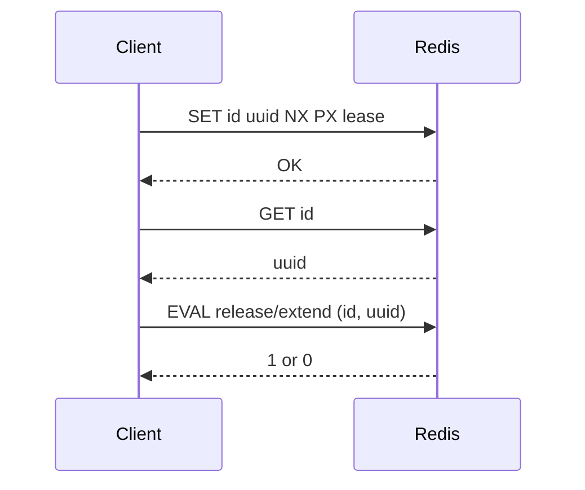

Every lock acquisition generates a UUID that represents ownership. That UUID is stored in Redis and cached inside the `Lock` instance. When you release or extend a lock, the library validates that the UUID in Redis still matches the one held by the instance. This prevents releasing or extending a lock that you no longer own.



**What it is**
Ownership is the relationship between a `Lock` instance and the Redis key it created. The UUID is that ownership token.

**Why it exists**
Locks can expire or be taken over by another client. Without ownership validation, a late `release()` could delete someone else's lock and break mutual exclusion.

**How it relates to other concepts**
- Ownership is established during [Lock Lifecycle](./lock-lifecycle).
- Ownership validation is the reason `extend()` and `release()` use Lua scripts for atomicity.
- You can explicitly set the UUID using `LockAcquireConfig` when needed.

**Example: UUID selection during acquire**

```typescript src/lock.ts
let UUID: string;
if (acquireConfig?.uuid) {
  UUID = acquireConfig.uuid;
} else {
  try {
    UUID = crypto.randomUUID();
  } catch (error) {
    throw new Error('No UUID provided and crypto module is not available in this environment.');
  }
}
```

**Example: Release only when UUID matches**

```typescript src/lock.ts
const script = `
      -- Check if the current UUID still holds the lock
      if redis.call("get", KEYS[1]) == ARGV[1] then
        return redis.call("del", KEYS[1])
      else
        return 0
      end
     `;

const numReleased = await this.config.redis.eval(script, [this.config.id], [this.config.UUID]);
return numReleased === 1;
```

<Callout type="warn">If the lock expires and is re-acquired by another client, your UUID will no longer match and `release()` will return `false`. You should treat that as a signal that the lock is no longer yours.</Callout>

<Accordions>
  <Accordion title="Trade-offs and alternatives">
  UUID ownership protects against accidental release, but it does not stop two clients from acquiring the lock during network partitions. Stronger coordination models (quorum-based locks or dedicated services) can reduce that risk at the cost of complexity.
  </Accordion>
</Accordions>
